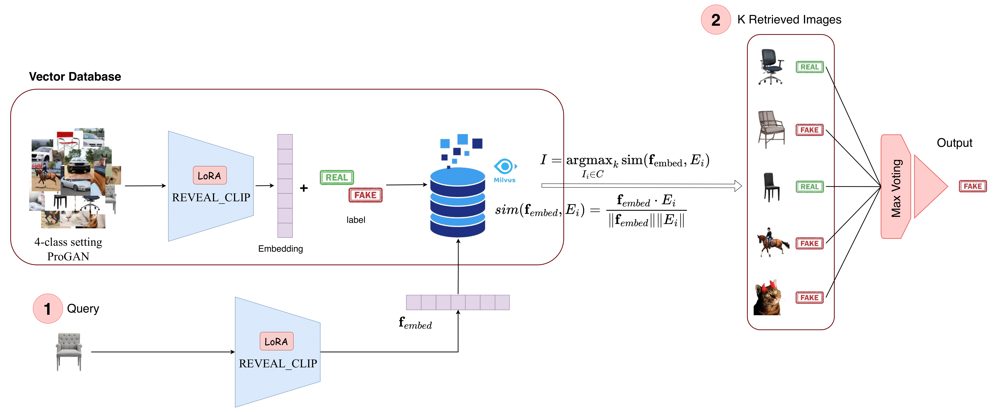

# REVEAL

[](https://doi.org/10.1145/3746265.3759667)
[](#)
[](#)

---

## 🧩 Abstract

Detecting AI-generated images remains challenging due to the lack of robustness and generalization in existing methods.  
**REVEAL** introduces a **retrieval-augmented generation (RAG)** framework that identifies synthetic visual content by leveraging visual context instead of low-level artifacts or model-specific features.

REVEAL fine-tunes a CLIP encoder to extract concept-aware embeddings, retrieves the *k* most similar labeled images from a vector database (e.g., Milvus), and determines the final label via **majority voting**.  
This lightweight and interpretable strategy achieves:

- **93.90% accuracy** on UniversalFakeDetect  
- **80.29% accuracy under degradation** (Gaussian blur, JPEG compression)  
- **78.81% average accuracy** on unseen data domains

---

## 🚀 Highlights

- 🔍 **Retrieval-Augmented Detection**  
  Uses labeled visual retrieval + majority voting instead of complex fusion.

- 🧠 **Fine-Tuned CLIP Encoder (REVEAL_CLIP)**  
  Learns concept-aware embeddings using LoRA and category-level prompts.

- ⚙️ **Efficient and Interpretable**  
  Majority vote across retrieved samples—no multimodal fusion needed.

- 📊 **State-of-the-Art Results**  
  Outperforms C2P-CLIP and RINE on 19 generative models.

---

## 🧱 Method Overview



1. **Embed Query Image** using fine-tuned CLIP (`REVEAL_CLIP`)  
2. **Retrieve Top-k Similar Images** from a Milvus vector database  
3. **Aggregate Labels** via majority voting  
4. **Output Classification:** *Real* or *Fake*

---

## 📦 Installation

```bash
git clone https://github.com/Mamadou-Keita/REVEAL.git
cd REVEAL
pip install -r requirements.txt
```

## 🧠 Citation

If you use REVEAL in your work, please cite:

```bibtex
@inproceedings{keita2025reveal,
  title     = {REVEAL: A Retrieval-Augmented Generation Approach for Contextual Identification of Synthetic Visual Content},
  author    = {Keita, Mamadou and Hamidouche, Wassim and Eutamene, Hessen B. and Taleb-Ahmed, Abdelmalik and Hadid, Abdenour},
  booktitle = {Proceedings of the 1st Deepfake Forensics Workshop (DFF ’25)},
  year      = {2025},
  address   = {Dublin, Ireland},
  doi       = {10.1145/3746265.3759667}
}
```

---

## 📚 References

For a complete list of references, see the [full paper (PDF)](./REVEAL.pdf) or [ACM Digital Library link](https://doi.org/10.1145/3746265.3759667).

---

## 🤝 Acknowledgments

This work was partially funded by the **MARTINI project (PCI2022-134990-2)** under the **CHISTERA IV Cofund 2021** program. 
